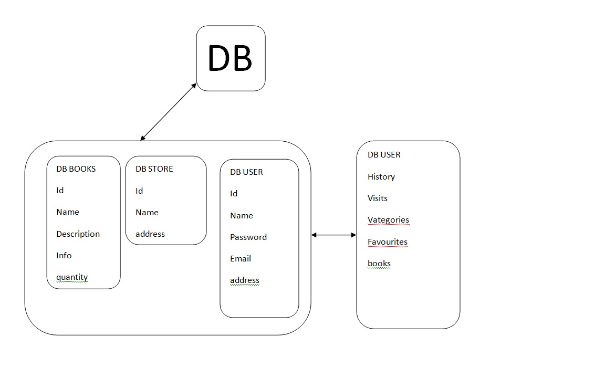

# Replication2

## Задание 1
Опишите основные преимущества использования масштабирования методами:

активный master-сервер и пассивный репликационный slave-сервер;
master-сервер и несколько slave-серверов;

### Ответ:

Активный master-сервер и пассивный репликационный slave-сервер;
При таком горизонтальном масштибировании у нас есть сервер для внесения, редактирования данных и копия сервера, которую можно использовать для чтения данных. Так как у нас всего два сервера то получаем простую настройку и минимальную нагрузку на сеть + безопасность данных, так как есть копия в виде slave-сервера

master-сервер и несколько slave-серверов;
При таком масштабировании у нас больше серверов для чтения, следовательно запросов на чтение данных может быть больше, у нас больше копий данных, но возрастает и сложность настройки, идет больше нагрузка на сеть из-за синхронизации данных и общения между серверами.

## Задание 2
Разработайте план для выполнения горизонтального и вертикального шаринга базы данных. База данных состоит из трёх таблиц:

пользователи,
книги,
магазины (столбцы произвольно).
Опишите принципы построения системы и их разграничение или разбивку между базами данных.

Пришлите блоксхему, где и что будет располагаться. Опишите, в каких режимах будут работать сервера.

### Ответ:

Мы можем разбить общую БД на отдельные БД - DB Users, DB Books, DB Stores - это будет вертикальный шардинг, вторым шагом мы можем, например, большую БД с пользователями разбить на 2 сервера (горизонтальный шардинг) и на 1 сервере оставить id, имя, пароль, почту, адрес, телефон на другом сервере будем хранить историю заказов, посещения, любимые категории, избранные книги, доступ к книгам онлайн. Два сервера будут работать как master-сервера, для повышения производительности можно к первому серверу добавить slave-сервер.

